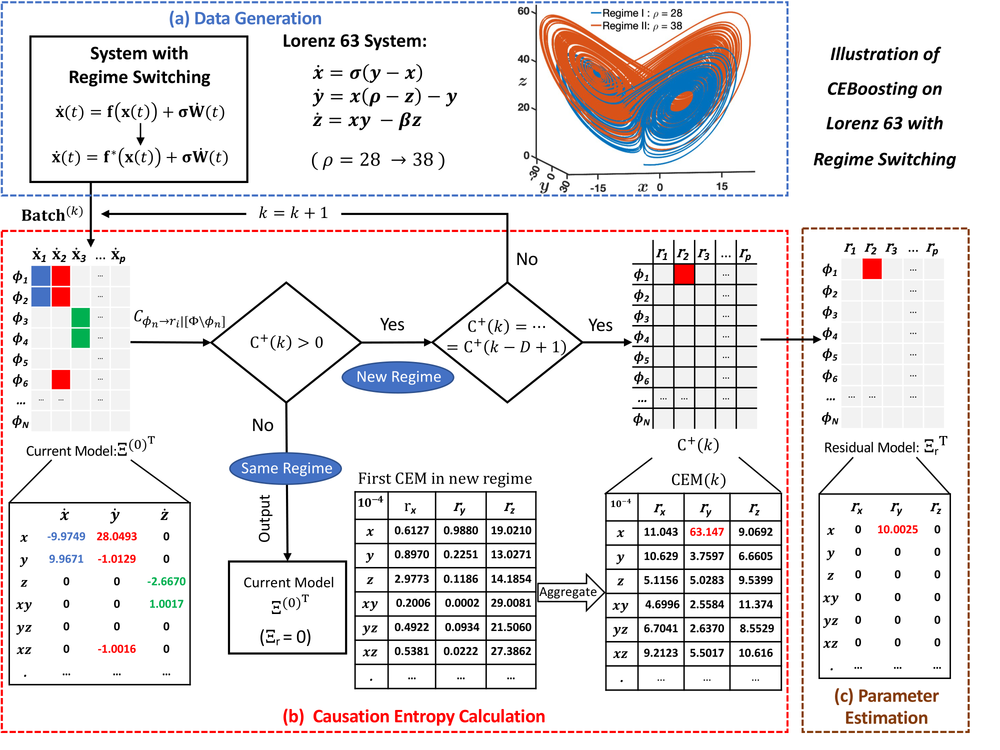

# Causation Entropy Boosting

This repository contains the code for the paper:
- [CEBoosting: Online Sparse Identification of Dynamical Systems with Regime Switching by Causation Entropy Boosting](https://arxiv.org/abs/2304.07863)

In this work, we developed a causation entropy boosting (CEBoosting) framework for online system identification with regime switching. With sequential data from dynamical systems with regime switching, CEBoosting aims to online (i) identify the regime switching and (ii) learn a model for the new regime .


For each sequential data batch, this framework calculates the causation entropy that evaluates the contribution of each function in a large set of candidate functions to the system dynamics. The causation entropies based on multiple data batches are then aggregated to identify a few candidate functions that have significant impacts on the system dynamics. With the identified sparse set of candidate functions, the framework further fits a model of the system dynamics based on the data batches. 


We tested the proposed framework for complex systems with features including chaotic behavior, high dimensionality, intermittency and extreme events, and partial observations. The results show that the CEBoosting method can capture the regime switching and then fit models of system dynamics for various types of complex dynamical based on a limited amount of sequential data.

Relevant works:
- [A causality-based learning approach for discovering the underlying dynamics of complex systems from partial observations with stochastic parameterization](https://www.sciencedirect.com/science/article/pii/S0167278923000970)

<p align="center">

</p>


## Citations

```
@article{chen2023ceboosting,
  title={CEBoosting: Online Sparse Identification of Dynamical Systems with Regime Switching by Causation Entropy Boosting},
  author={Chen, Chuanqi and Chen, Nan and Wu, Jin-Long},
  journal={arXiv preprint arXiv:2304.07863},
  year={2023}
}


@article{chen2023causality,
  title={A causality-based learning approach for discovering the underlying dynamics of complex systems from partial observations with stochastic parameterization},
  author={Chen, Nan and Zhang, Yinling},
  journal={Physica D: Nonlinear Phenomena},
  volume={449},
  pages={133743},
  year={2023},
  publisher={Elsevier}
}
```
